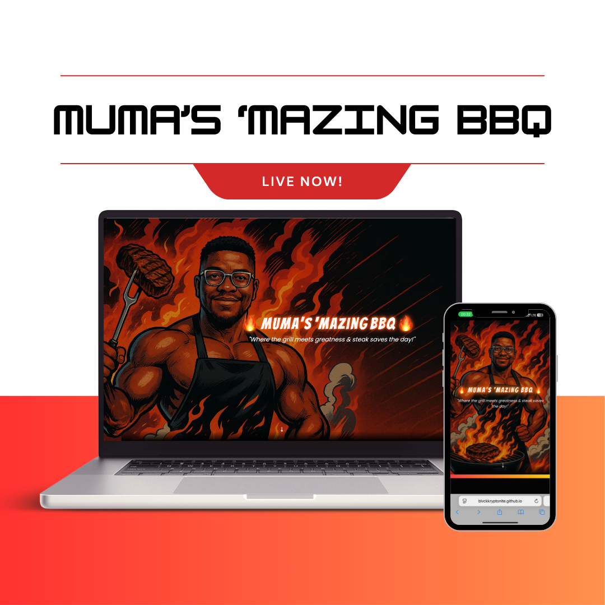
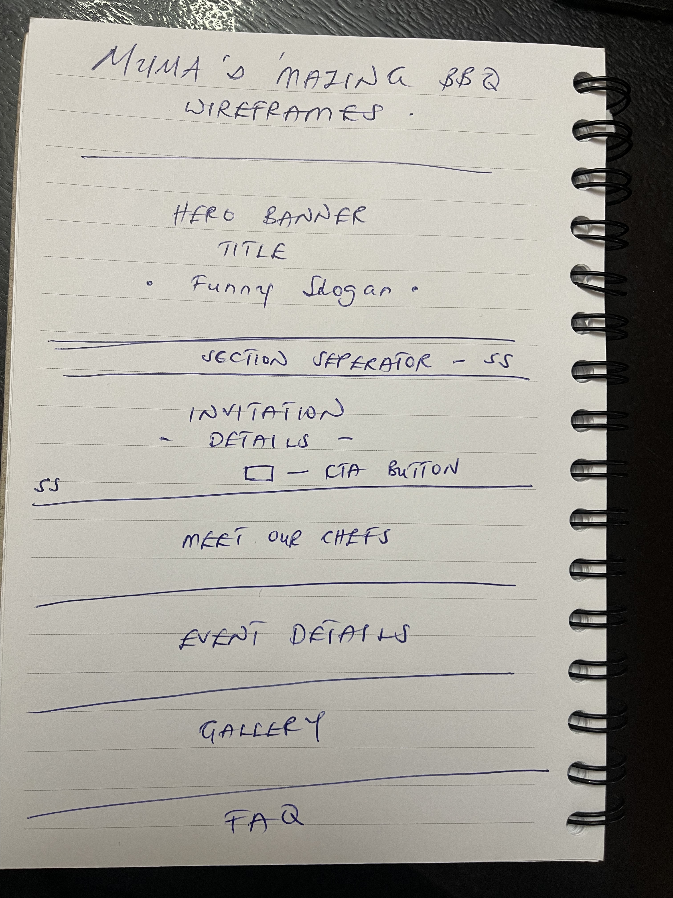
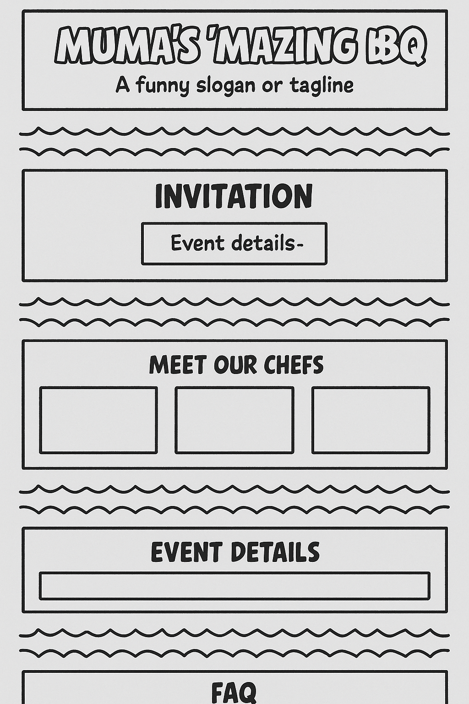

# Muma’s ‘Mazing Barbeque 🍖🔥

Welcome to **Muma’s ‘Mazing Barbeque** — a comic book-inspired, over-the-top landing page designed to excite, entertain, and entice food lovers to RSVP to the (fictional) hottest grill party in the multiverse.

---

## 📸 Live Preview

> Deployed with [Vite](https://vitejs.dev/) + React and hosted via GitHub Pages. *(https://blvckkryptonite.github.io/mumas-mazing-barbeque/)*

---

## 🎯 Project Purpose

This project was created as a fun, high-impact frontend application using React, Tailwind CSS, and animation libraries. It allowed exploration of complex UI, animation techniques, and theme integration — all styled to feel like a comic book hero event.

---

## 🦸‍♂️ Features

- **Animated Hero Banner** with comic-style heading and slogan
- **Full-screen background image** with styled text offset
- **Scroll-animated sections** using Framer Motion
- **Chef Bio Cards** with creative one-liners and hover interactions
- **Ticket CTA Buttons** repeated for emphasis
- **Comic-themed fonts** and custom styling
- **Gallery Section**
- **FAQ Section**
- **Google Map Embed** for venue
- **Dark Theme with Fire/Red Gradients**
- **Fully Responsive & Accessible**
- **Stripe integration for ticket sales (planned)**

---

## 🛠️ Technologies Used

### Core Tech Stack
- **React.js** – Component-based frontend framework
- **Vite** – Fast build tool and dev server
- **Node.js / npm** – Package management
- **Tailwind CSS** - Utility-first custom styling
- **Framer Motion** - Animation library for scroll and element animation
- **React Router DOM** - Routing (for multi-page ticket integration)
- **SplitWords** - For word-based & emoji animation handling

### Fonts & Assets
- **Bangers** (for comic-style headers)
- **Poppins** (for body)
- **AI-Generated Comic Art** using Midjourney and reference images

---

## 📱 Responsiveness

Muma’s ‘Mazing BBQ is fully responsive and optimized for seamless viewing across all devices. Whether you're browsing on a large desktop screen or a small mobile phone, the layout adapts beautifully to ensure clarity, usability, and fun.

Responsive design was achieved using **Tailwind CSS** with custom breakpoints, fluid typography, and flexible layout structures to preserve the comic-style vibe on any screen size.

### Desktop & Mobile Mockups


 


---


## 🔲 Wireframes

Below is the initial wireframe sketch and a refined digital wireframe for the Muma’s ‘Mazing BBQ landing page. These mockups were created to outline the structure, flow, and content hierarchy of the site in a fun and intuitive way.

### 📝 Hand-written draft structure



*Original hand-drawn layout showing section flow and content plans.*

---

### 💻 AI Enhanced Wireframe Sketch (Low-Fidelity)



*Comic-style low-fidelity wireframe representing key sections:*

- **Hero Banner:** Title and a funny slogan
- **Invitation:** Event details and a CTA button
- **Meet Our Chefs:** Visual grid of featured chefs
- **Event Details:** Time, location, and schedule info
- **Gallery:** Highlight reels and photos
- **FAQ:** Common questions answered
- **Section Separators:** Comic-style dividers between each section

---

These wireframes were used to guide layout and component structure before styling and animations were added with Tailwind CSS, React, and Framer Motion.

---

## 🗂️ Folder Structure

```
mumas-mazing-barbeque/
├── public/
│   └── index.html
├── src/
│   ├── assets/
│   ├── components/
│   │   ├── HeroBanner.jsx
│   │   ├── Invitation.jsx
│   │   ├── Chefs.jsx
│   │   ├── Gallery.jsx
│   │   ├── FAQ.jsx
│   │   └── Location.jsx
│   ├── styles/
│   │   └── tailwind.css
│   ├── App.jsx
│   └── main.jsx
├── tailwind.config.js
├── vite.config.js
└── package.json

```

---

## Design Notes

### Fonts
- `font-heading`: Bangers
- `font-body`: Poppins

### Colors
- **Primary**: Black/Dark Gray
- **Secondary**: Red, Yellow-Orange (Flame Gradient)

---

## 📦 Installation Instructions

```bash
git clone https://github.com/BlvckKryptonite/mumas-mazing-barbeque.git
cd mumas-mazing-barbeque
npm install
npm run dev
```

Open `http://localhost:5003/` or whichever port Vite assigns.

---

## Development Notes

### Challenges Encountered 🚧

1. **Localhost 404 Errors**
   - **Cause**: Vite expected `index.html` in `public/`, but it was mistakenly placed in the root.
   - **Fix**: Moved `index.html` into the root directory and ensured correct project structure.

2. **Vite Not Loading**
   - **Cause**: Conflicting Vite version or missing dependencies.
   - **Fix**: Clean install and port change detection.

3. **Missing Image Rendering**
   - **Cause**: Background image placement in hero banner required careful positioning.
   - **Fix**: Absolute/relative layout with Tailwind and flexbox.

4. **Font Configuration Not Applying**
   - **Cause**: Misnamed font class or missing import from Google Fonts.
   - **Fix**: Imported Bangers and Poppins properly and extended Tailwind config.

5. **Animations Not Working**
   - **Cause**: Incorrect import or Framer Motion not installed.
   - **Fix**: Ran `npm install framer-motion` and ensured correct component usage.
6. **Hero image not displaying correctly**
   - **Fix**:** Used bg-cover bg-center flex justify-end for image alignment and responsiveness.

   ### Other fixes:
   - Tailwind not applying due to incorrect content paths → Fixed
   - JSX structure breaking Framer Motion → Fixed with proper <motion> wrapping


---

## 📈 Performance & Optimization

- I plan to deploy the project on [Vercel](https://vercel.com/) to take advantage of its fast global CDN, optimized static rendering, and seamless integration with React for improved performance and near-instant load times.
- Lazy loading sections and background images (in progress)
- Scroll-triggered animations only activate when in view
- Hero image and components styled to maximize visual appeal without excessive asset weight

---

## Future Enhancements

- Loading animation (comic style "Page Flip" or flaming grill spinner)
- Section transitions with fire or smoke effects
- Stripe-powered RSVP or ticket sales form
- Fully animated parallax scroll effects
- Add sound FX toggle (comic zap, sizzle, etc.)

---

## Recent Updates (July 2025)

- ✅ **Stripe Integration Complete** - Full payment processing with secure checkout
- ✅ **Parallax Effects Implemented** - Enhanced visual scrolling experience
- ✅ **Sound Effects Added** - Toggle-able comic sound effects
- ✅ **Loading Animations** - Comic-style page transitions
- ✅ **Enhanced User Experience** - Responsive design with modern animations

---

## 💬 Attribution & Credits

- Comic Fonts: [Google Fonts](https://fonts.google.com/)
- Animations: [Framer Motion](https://www.framer.com/motion/)
- Images generated using Midjourney and real photos of Chef Muma
- Inspired by [dogelonmars.com](https://dogelonmars.com/)

---

## 🧠 Lessons Learned

> Sometimes, it's the **smallest issues** (like an `index.html` in the wrong folder) that cause the biggest confusion.

This project deepened understanding of Vite + React workflows, Tailwind theming, animated UIs, and the importance of checking structural integrity during local setup.

---

## 🔗 Connect With Me

Want to book Muma’s ‘Mazing Barbeque at your event or collaborate on something cool? Reach out!

- Email: [mumathedeveloper@gmail.com](mailto:yourname@example.com)
- GitHub: [BlvckKryptonite](https://github.com/BlvckKryptonite)

---

> **“Where the grill meets greatness — and the steak saves the day.”**